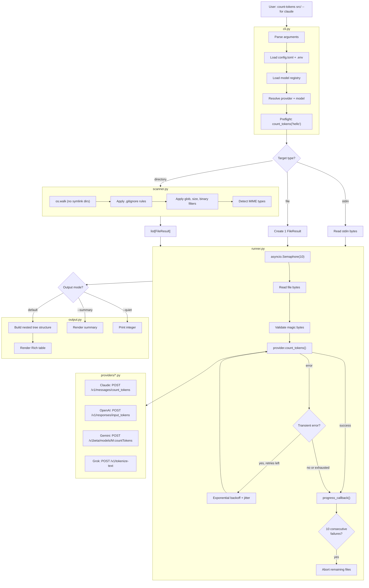
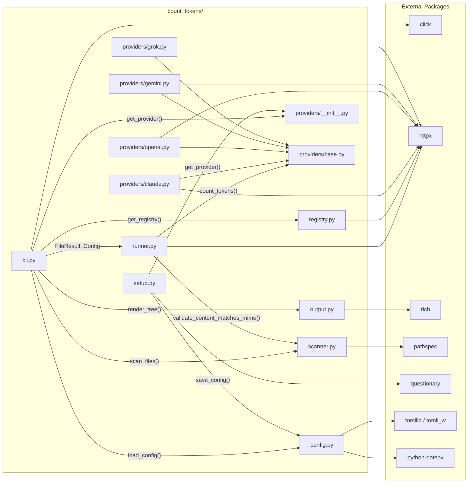

# count-tokens


Count the tokens a file or directory would consume across LLM providers. Understand the impact to your context window before you spend the tokens.

## Table of Contents

- [Overview](#overview)
- [Installation](#installation)
- [Quick Start](#quick-start)
- [Usage Examples](#usage-examples)
- [Provider Comparison](#provider-comparison)
- [Output Format](#output-format)
- [Configuration](#configuration)
- [How It Works](#how-it-works)
- [Architecture](#architecture)
- [Module Dependencies](#module-dependencies)
- [Project Structure](#project-structure)
- [Adding a New Provider](#adding-a-new-provider)
- [Updating for New Models](#updating-for-new-models)
- [Troubleshooting](#troubleshooting)
- [Testing](#testing)

## Overview

`count-tokens` is a command-line tool that counts how many tokens your files would consume when loaded into a large language model. It supports four providers:

- **Claude** (Anthropic) — text, images, PDFs
- **OpenAI** (GPT) — text, images, PDFs, Office documents
- **Gemini** (Google) — text, images, PDFs, and more
- **Grok** (xAI) — text only

The tool calls each provider's official token counting API directly via `httpx` — no provider SDKs, no local tokenizers. You get the same count the provider would charge you for.

Output includes a tree-style breakdown with context window percentages for three usage modes: your coding agent, web chat, and the API.

## Installation

Requires Python 3.11 or later and [uv](https://docs.astral.sh/uv/).

```bash
# Install from GitHub
uv tool install git+ssh://git@github.com/captivus/count-tokens.git

# Or clone and run locally
git clone git@github.com:captivus/count-tokens.git
cd count-tokens
uv sync
uv run count-tokens

# The short alias also works
uv run ct
```

## Quick Start

### 1. Configure your providers

```bash
count-tokens setup
```

The interactive wizard walks you through selecting providers, entering API keys, choosing your subscription plan, and picking default models. API keys are validated with a real token counting call during setup.

### 2. Count tokens for a file

```bash
count-tokens main.py --for claude
```

### 3. Count tokens for a directory

```bash
count-tokens src/ --for gemini
```

Output looks like this:

```
Provider: gemini (gemini-2.5-flash)

File           Tokens  Agent    Web    API
src/           [2,829]   0.3%   0.3%   0.3%
  module.py      1,203   0.1%   0.1%   0.1%
  utils.py         890  <0.1%  <0.1%  <0.1%
  config.py        736  <0.1%  <0.1%  <0.1%

Total: 2,829 tokens
  Agent (1M):  0.3%
  Web (1M):    0.3%
  API (1M):    0.3%
```

## Usage Examples

### Single file

```bash
count-tokens app.py --for claude
count-tokens document.pdf --for openai
count-tokens image.png --for gemini
```

### Directory (recursive)

```bash
count-tokens src/ --for claude
count-tokens . --for gemini --glob "*.py"
```

### Stdin

```bash
echo "Hello, world!" | count-tokens - --for openai
cat README.md | count-tokens - --for claude
```

### Quiet mode (for scripting)

Returns just the token count as an integer:

```bash
count-tokens src/ --for claude -q
# Output: 4812
```

Useful in scripts:

```bash
TOKENS=$(count-tokens src/ --for claude -q)
echo "This codebase uses $TOKENS tokens"
```

### Summary mode

Totals only, no file tree:

```bash
count-tokens src/ --for openai --summary
```

### Filter by glob pattern

```bash
count-tokens src/ --for gemini --glob "*.py"
count-tokens . --for claude --glob "*.{py,ts,js}"
```

### Filter by file size

```bash
count-tokens . --for openai --max-size 1MB
```

The default maximum file size is 50MB. Files larger than the limit are skipped.

### Override model

```bash
count-tokens file.py --model gpt-4o-mini
count-tokens file.py --model gemini-2.5-pro
```

When you use `--model`, the provider is automatically inferred from the model name.

### Suppress progress bar

```bash
count-tokens src/ --for claude --no-progress
```

Useful when an AI agent is invoking the tool.

### Include gitignored files

```bash
count-tokens . --for gemini --no-gitignore
```

By default, files matching `.gitignore` patterns are skipped. This flag includes them.

### Include binary files

```bash
count-tokens . --for openai --include-binary
```

Binary files (executables, archives, etc.) are excluded by default. Most providers can't tokenize them, so they'll likely show up as skipped.

### Flags reference

| Flag | Description | Default |
|------|-------------|---------|
| `--for <provider>` | Provider to use (`claude`, `openai`, `gemini`, `grok`) | From config |
| `--model <model-id>` | Specific model (provider auto-inferred) | From config |
| `--glob <pattern>` | Filter files by glob pattern | All files |
| `--max-size <size>` | Max file size (`KB`, `MB`, `GB`) | `50MB` |
| `--no-gitignore` | Include gitignored files | Off |
| `--include-binary` | Include binary files | Off |
| `--concurrency <n>` | Concurrent API requests | `10` |
| `--retries <n>` | Retry count for transient errors | `3` |
| `--mime-type <type>` | Override MIME detection (for stdin) | Auto-detect |
| `-q` / `--quiet` | Output only the token count integer | Off |
| `--summary` | Output totals only, no tree | Off |
| `--no-progress` | Suppress progress bar | Off |

### Subcommands

| Command | Description |
|---------|-------------|
| `count-tokens setup` | Interactive configuration wizard |
| `count-tokens models` | List known models for configured providers |
| `count-tokens models --refresh` | Update model registry from GitHub |

## Provider Comparison

| Capability | Claude | OpenAI | Gemini | Grok |
|-----------|--------|--------|--------|------|
| **Text / code** | Yes | Yes | Yes | Yes |
| **JPEG, PNG, GIF, WebP** | Yes | Yes | Yes | No |
| **HEIC, BMP, TIFF, SVG** | No | No | Yes | No |
| **PDF** | Yes | Yes | Yes | No |
| **Office docs (docx, xlsx, pptx)** | No | Yes | No | No |
| **API endpoint** | `/v1/messages/count_tokens` | `/v1/responses/input_tokens` | `/v1beta/models/{model}:countTokens` | `/v1/tokenize-text` |
| **Free to call** | Yes | Not documented | Yes | Not documented |
| **Per-modality breakdown** | No | No | Yes | No |
| **Rate limits** | 100-8,000 RPM (by tier) | Not documented | 3,000 RPM | Not documented |

### Accuracy notes

- **Claude** returns an estimate that may differ slightly from actual usage. May include system-added tokens (not billed).
- **OpenAI** is deterministic for the same input. PDFs extract both text and page images, so counts can be higher than expected.
- **Gemini** returns a per-modality breakdown (TEXT, IMAGE, etc.) alongside the total count.
- **Grok** explicitly underestimates because "inference endpoints automatically add pre-defined tokens." Text only — no image or document support.

## Output Format

### Tree view (default)

The default output shows a file tree with token counts and three context window percentage columns:

```
Provider: claude (claude-sonnet-4-6)

File             Tokens  Agent    Web    API
src/            [4,812]   0.5%   2.4%   0.5%
  main.py        1,203   0.1%   0.6%   0.1%
  utils.py         890  <0.1%   0.4%  <0.1%
  config.py        736  <0.1%   0.4%  <0.1%
tests/          [1,983]   0.2%   1.0%   0.2%
  test_main.py     890  <0.1%   0.4%  <0.1%
  test_utils.py  1,093   0.1%   0.5%   0.1%

Total: 6,795 tokens
  Agent (1M):  0.7%
  Web (200K):    3.4%
  API (1M):    0.7%
```

### The three columns

Each column shows what percentage of the context window your files consume in a different usage mode:

| Column | What it measures | Source |
|--------|-----------------|--------|
| **Agent** | Your coding agent (Claude Code, Codex, Gemini CLI) | Configured agent model's context window |
| **Web** | Web chat (claude.ai, ChatGPT, Gemini web) | Determined by your subscription plan tier |
| **API** | Direct API usage | Configured API model's context window |

These context windows can be very different. For example, with OpenAI on a Plus plan: the API model might have a 1M context window while the web chat is limited to 32K. The same 4,000 tokens would be 0.4% of API but 12.5% of web.

For providers without a coding agent (Grok), the Agent column shows "N/A".

### Quiet mode

Just the integer, nothing else:

```
4812
```

### Summary mode

Totals and percentages, no tree:

```
Provider: openai (gpt-4o-mini)

Total: 4,812 tokens
  Agent (1M):  0.5%
  Web (32K):    15.0%
  API (1M):    0.5%
```

### Skipped and failed files

Unsupported or problematic files are reported after the main output:

```
Skipped (2 files):
  report.docx — application/vnd.openxmlformats-officedocument.wordprocessingml.document not supported by claude
  archive.zip — application/zip not supported by claude

Failed (1 files):
  corrupt.pdf — HTTP 400: Invalid PDF content
```

## Configuration

### File locations

Configuration lives in `~/.config/count-tokens/`:

| File | Purpose |
|------|---------|
| `config.toml` | Provider settings, plan tiers, default models |
| `.env` | API keys |
| `models.json` | Cached LiteLLM model registry |

### config.toml schema

```toml
default_provider = "claude"

[providers.claude]
model = "claude-sonnet-4-6"          # Model for API token counting
agent_model = "claude-opus-4-6"      # Model your coding agent uses
plan = "max_20x"                     # Your subscription plan
has_coding_agent = true              # Do you use Claude Code?

[providers.openai]
model = "gpt-4o-mini"
agent_model = "gpt-4o-mini"
plan = "plus"
has_coding_agent = true

[providers.gemini]
model = "gemini-2.5-flash"
agent_model = "gemini-2.5-flash"
plan = "ai_pro"
has_coding_agent = true

[providers.grok]
model = "grok-4"
plan = "x_premium_plus"
has_coding_agent = false              # Grok has no coding agent
```

### .env format

```
ANTHROPIC_API_KEY=sk-ant-...
OPENAI_API_KEY=sk-proj-...
GEMINI_API_KEY=AI...
GROK_API_KEY=xai-...
```

The tool also checks for a `.env` file in the current directory and falls back to environment variables.

### Plan-to-web-context-window mapping

Your subscription plan determines the Web column's context window:

| Provider | Plan | Web Context Window |
|----------|------|--------------------|
| Claude | Free, Pro, Max, Team, Team Premium | 200K |
| Claude | Enterprise | 500K |
| OpenAI | Free | 16K |
| OpenAI | Go | 32K |
| OpenAI | Plus, Business | 32K |
| OpenAI | Pro, Enterprise | 128K |
| Gemini | Free | 32K |
| Gemini | AI Plus | 128K |
| Gemini | AI Pro, AI Ultra | 1M |
| Grok | Free, X Premium, X Premium+ | 128K |
| Grok | SuperGrok | 128K |
| Grok | SuperGrok Heavy | 256K |

### Runtime overrides

- `--for <provider>` overrides the default provider for one run
- `--model <model-id>` overrides to a specific model (provider auto-inferred)
- `--model` takes precedence over `--for` if both are specified

## How It Works

Here's what happens when you run `count-tokens src/ --for claude`:

1. **CLI parses arguments.** The Click-based CLI parses the target path, provider, and flags. If no provider is given, it reads the default from `~/.config/count-tokens/config.toml`.

2. **Configuration is loaded.** API keys come from `~/.config/count-tokens/.env`, the current directory's `.env`, or environment variables. The subscription plan and default models come from `config.toml`.

3. **Model metadata is resolved.** The LiteLLM model registry (a cached JSON file with data on 2,600+ models) provides context window sizes for the Agent, Web, and API columns.

4. **Provider is instantiated and validated.** The appropriate provider class is created with the API key. A preflight check sends a minimal token count request (`"hello"`) to verify the model name and API key work before processing any real files.

5. **Files are discovered and filtered.** The scanner walks the directory recursively, applying filters in this order: skip symlinked directories, skip gitignored files (walks up to `.git` root for nested `.gitignore` support), skip files over the size limit, detect MIME type (extension-based), skip non-matching glob patterns, skip binary files.

6. **Token counting runs concurrently.** The async runner processes files through an `asyncio.Semaphore` (default 10 concurrent requests). For each file: read content, validate magic bytes match the MIME type, call the provider's REST endpoint via `httpx`. On transient errors (429, 5xx), retry with exponential backoff and jitter. A circuit breaker aborts after 10 consecutive failures. A progress bar updates after each file completes.

7. **Output is rendered.** The results are assembled into a nested tree structure (matching the directory layout), then rendered as a Rich table with token counts and context window percentages.

## Architecture



## Module Dependencies



### Key interfaces

| Interface | File | Purpose |
|-----------|------|---------|
| `TokenCountProvider` | `providers/base.py` | Protocol that all providers implement |
| `TokenCountResult` | `providers/base.py` | Returned by `count_tokens()` — holds total tokens and optional modality breakdown |
| `FileResult` | `providers/base.py` | Tracks per-file status through the pipeline (pending → success/failed/skipped) |
| `Config` / `ProviderConfig` | `providers/base.py` | Configuration data structures |
| `Prompter` | `setup.py` | Protocol for the setup wizard's interactive prompts (has `QuestionaryPrompter` and `FixedPrompter` implementations) |

## Project Structure

```
src/count_tokens/
    __init__.py              # Package version
    __main__.py              # python -m count_tokens entry point
    cli.py                   # Click CLI: argument parsing, orchestration
    config.py                # Config load/save, .env handling, web context windows
    setup.py                 # Setup wizard: Prompter protocol, model validation
    registry.py              # LiteLLM JSON: fetch, cache, model lookup
    scanner.py               # File discovery: gitignore, glob, MIME, magic bytes
    runner.py                # Async orchestrator: semaphore, retries, circuit breaker
    output.py                # Rich rendering: tree, summary, quiet modes
    providers/
        __init__.py          # Provider registry and get_provider()
        base.py              # Protocol, dataclasses, exceptions
        claude.py             # Anthropic token counting
        openai.py             # OpenAI token counting
        gemini.py             # Google Gemini token counting
        grok.py               # xAI Grok token counting
tests/
    conftest.py              # Shared fixtures, environment loading
    fixtures/                # Test files (text, images, PDF, docx, directory tree)
    test_preflight.py        # Validates configured models work with APIs
    test_provider_matrix.py  # Every provider x every file type
    test_e2e_pipeline.py     # Full config → CLI → API → output pipeline
    test_providers.py        # Individual provider API tests
    test_cli.py              # CLI argument handling and output tests
    test_config.py           # Config save/load, setup wizard logic
    test_registry.py         # Model registry lookup and caching
    test_scanner.py          # File discovery, MIME detection, filtering
```

## Adding a New Provider

This tutorial walks through adding a hypothetical "Mistral" provider. Use `grok.py` as your reference — it's the simplest provider at ~35 lines.

### Step 1: Create the provider file

Create `src/count_tokens/providers/mistral.py`:

```python
"""Mistral token counting provider."""

import httpx

from count_tokens.providers.base import TokenCountResult, UnsupportedFileTypeError

# Define which MIME types this provider supports beyond text/*
NON_TEXT_SUPPORTED = {"application/json", "application/xml"}


class MistralProvider:
    provider_name = "mistral"

    def __init__(self, *, api_key: str):
        self._api_key = api_key

    def supported_mime_types(self) -> set[str]:
        return NON_TEXT_SUPPORTED | {"text/*"}

    async def count_tokens(
        self, *, content: bytes, mime_type: str, model: str
    ) -> TokenCountResult:
        # Guard: empty content returns 0
        if not content:
            return TokenCountResult(total_tokens=0, model=model)

        # Guard: unsupported MIME type
        if not (mime_type.startswith("text/") or mime_type in NON_TEXT_SUPPORTED):
            raise UnsupportedFileTypeError(
                mime_type=mime_type, provider=self.provider_name
            )

        # Build and send the HTTP request
        text = content.decode(errors="replace")
        async with httpx.AsyncClient() as client:
            response = await client.post(
                "https://api.mistral.ai/v1/tokenize",
                headers={
                    "Authorization": f"Bearer {self._api_key}",
                    "Content-Type": "application/json",
                },
                json={"model": model, "text": text},
                timeout=120.0,
            )
            response.raise_for_status()
            data = response.json()
            return TokenCountResult(
                total_tokens=data["token_count"], model=model
            )
```

### Step 2: Register the provider

In `src/count_tokens/providers/__init__.py`, add the import and registration:

```python
from count_tokens.providers.mistral import MistralProvider

PROVIDERS: dict[str, type[TokenCountProvider]] = {
    "claude": ClaudeProvider,
    "openai": OpenAIProvider,
    "gemini": GeminiProvider,
    "grok": GrokProvider,
    "mistral": MistralProvider,  # Add this
}

PROVIDER_ENV_KEYS: dict[str, str] = {
    "claude": "ANTHROPIC_API_KEY",
    "openai": "OPENAI_API_KEY",
    "gemini": "GEMINI_API_KEY",
    "grok": "GROK_API_KEY",
    "mistral": "MISTRAL_API_KEY",  # Add this
}
```

### Step 3: Add curated models to the setup wizard

In `src/count_tokens/setup.py`, update three dictionaries:

```python
CURATED_MODELS["mistral"] = ["mistral-large-latest", "mistral-small-latest"]
DEFAULT_MODELS["mistral"] = "mistral-small-latest"
ALL_PROVIDERS.append("mistral")
```

Also add entries in `src/count_tokens/setup.py` and `src/count_tokens/config.py`:

```python
# setup.py — add plan options for the setup wizard
PLAN_OPTIONS["mistral"] = [
    ("Free", "free"), ("Pro ($20/mo)", "pro"),
]

# config.py — add web context window mapping
WEB_CONTEXT_WINDOWS["mistral"] = {
    "free": 32_000, "pro": 128_000,
}
```

### Step 4: Add the provider mapping in the registry

In `src/count_tokens/registry.py`, add the LiteLLM provider prefix mapping:

```python
PROVIDER_MAP = {
    # ... existing entries ...
    "mistral": "mistral",  # Add this
}
```

### Step 5: Write tests

Add a fixture to `tests/conftest.py`:

```python
@pytest.fixture
def mistral_provider():
    return MistralProvider(api_key=os.environ.get("MISTRAL_API_KEY", ""))
```

Add a test class to `tests/test_provider_matrix.py`:

```python
@pytest.fixture
def mistral():
    return MistralProvider(api_key=os.environ.get("MISTRAL_API_KEY", ""))

@pytest.mark.mistral
class TestMistralMatrix:
    MODEL = "mistral-small-latest"

    def test_text(self, mistral):
        result = _count(mistral, *TEXT_FILE, self.MODEL)
        assert result.total_tokens > 0

    def test_binary_unsupported(self, mistral):
        with pytest.raises(UnsupportedFileTypeError):
            asyncio.run(mistral.count_tokens(
                content=b"\x00\x01", mime_type="application/octet-stream",
                model=self.MODEL,
            ))
```

Add a preflight test in `tests/test_preflight.py`, an end-to-end test in `tests/test_e2e_pipeline.py`, and register the `mistral` pytest marker in `pyproject.toml`.

### Step 6: Test it

```bash
uv run pytest tests/test_provider_matrix.py::TestMistralMatrix -v
uv run count-tokens setup  # Add Mistral in the wizard
uv run count-tokens file.py --for mistral
```

## Updating for New Models

LLM providers release new models frequently. Here's how to keep `count-tokens` current.

### Refresh the model registry

The LiteLLM model registry is updated multiple times daily. To pull the latest:

```bash
count-tokens models --refresh
```

This fetches the latest `model_prices_and_context_window.json` from GitHub and caches it locally at `~/.config/count-tokens/models.json`.

### Add a model to the curated setup list

When a new model is released, add it to `CURATED_MODELS` in `src/count_tokens/setup.py`:

```python
CURATED_MODELS = {
    "claude": ["claude-sonnet-4-6", "claude-opus-4-6", ...],
    "openai": ["gpt-4o-mini", "gpt-4o", ...],
    # Add new models to the appropriate provider list
}
```

### Update default models

If a new model should be the default, update `DEFAULT_MODELS` in the same file:

```python
DEFAULT_MODELS = {
    "claude": "claude-sonnet-4-6",
    "openai": "gpt-4o-mini",
    # ...
}
```

### Verify the model works

Before recommending a new model to users, verify it with the preflight test:

```bash
uv run pytest tests/test_preflight.py -v
```

Or test it manually:

```bash
count-tokens hello.py --model new-model-name
```

The preflight check in the CLI will tell you immediately if the model doesn't work with the token counting endpoint.

### Update your personal config

After adding new models, re-run setup to update your own configuration:

```bash
count-tokens setup
```

The wizard preserves your existing settings and lets you change just the model.

## Troubleshooting

### "Model not found in registry"

The model name isn't in the LiteLLM registry. Try:

```bash
count-tokens models --refresh
count-tokens models  # See what's available
```

If the model is very new, it may not be in the registry yet. Use `--model <name>` directly — the preflight check will tell you if the API accepts it.

### "API key not configured"

Your API key isn't set. Either run `count-tokens setup` or create/edit `~/.config/count-tokens/.env`:

```
ANTHROPIC_API_KEY=sk-ant-...
```

The tool also checks `.env` in the current directory and environment variables as fallbacks.

### "Preflight check failed"

The configured model doesn't work with the provider's token counting endpoint. This usually means:

- The model name is wrong or misspelled
- The model doesn't support the `countTokens` endpoint
- The model was deprecated or renamed

Try a different model: `count-tokens file.py --model <known-good-model>`

### Rate limiting (429 errors)

The tool handles rate limits automatically with exponential backoff and respects `Retry-After` headers. If you're hitting limits frequently, reduce concurrency:

```bash
count-tokens src/ --for claude --concurrency 3
```

### All files failing with the same error

This almost always means the configured model is invalid. The preflight check should catch this, but if files are failing, check:

```bash
count-tokens models  # Verify your configured model exists
count-tokens setup   # Re-run setup with a valid model
```

### Empty token counts (0 tokens)

This is normal for empty files. The tool returns 0 tokens without calling the API for empty files.

### Progress bar seems stuck

One or more API calls are slow. The default timeout is 120 seconds per request. PDFs and images can take longer to process server-side. The progress bar will update when the request completes or times out.

## Testing

Tests hit real provider APIs — no mocks. You need API keys for all four providers configured to run the full suite.

### Run all tests

```bash
uv run pytest tests/ -v
```

### Run tests for a specific provider

```bash
uv run pytest tests/ -m claude -v
uv run pytest tests/ -m openai -v
uv run pytest tests/ -m gemini -v
uv run pytest tests/ -m grok -v
```

### Test categories

| Test file | What it tests |
|-----------|--------------|
| `test_preflight.py` | Validates configured models work with real APIs |
| `test_provider_matrix.py` | Every provider against every supported file type |
| `test_e2e_pipeline.py` | Full config → CLI → API → output for all providers |
| `test_providers.py` | Individual provider API calls |
| `test_cli.py` | CLI argument handling and output modes |
| `test_config.py` | Config save/load, setup wizard logic, context window mappings |
| `test_registry.py` | Model registry lookup and provider inference |
| `test_scanner.py` | File discovery, MIME detection, gitignore, filtering |
